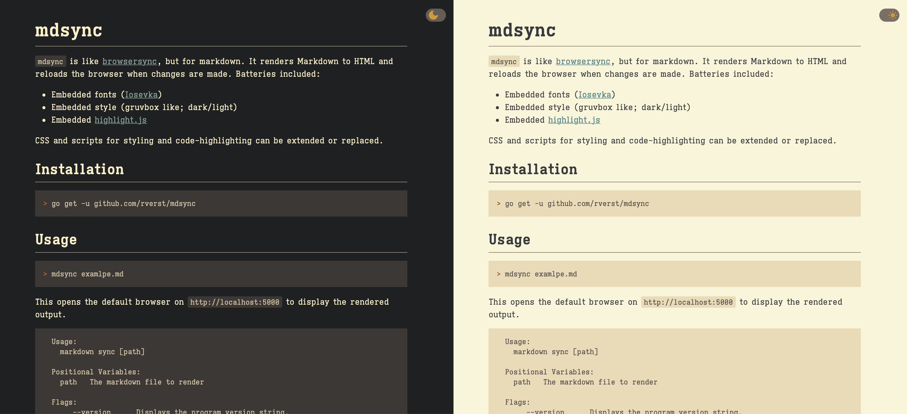

# mdsync

`mdsync` is like [browsersync](https://github.com/schollz/browsersync), but for markdown.
It renders Markdown to HTML and reloads the browser when changes are made.
Batteries included:
  - Embedded fonts ([Iosevka](https://github.com/be5invis/Iosevka))
  - Embedded style (gruvbox like; dark/light)



CSS and scripts for styling and code-highlighting can be extended or replaced. 

## Installation

```shell
> go get -u github.com/rverst/mdsync
```

## Usage

```shell
> mdsync examlpe.md
```
This opens the default browser on `http://localhost:5000` to display the rendered output.

```shell
  Usage:
    markdown sync [path]

  Positional Variables:
    path   The markdown file to render

  Flags:
       --version      Displays the program version string.
    -h --help         Displays this help.
    -c --css          A custom css path to style the output.
    -s --script       A custom script path to manipulate the output.
    -p --port         The port to server (default: 5000).
       --no-browser   Prevents the browser from being opened.
       --raw          No embedded scripts and styles, custom files will
                      work though.
```

With no arguments provided, the first markdown file in the current directory will be loaded.

With `--css` and `--script` custom styles or scripts can be loaded. These will be loaded
after the embedded [style.css](embedded/www/css/style.css) or [highlight.js](embedded/www/script/highlight.js).
With the switch -raw the embedded styles and scripts can be switched off (except for the reload-script).
